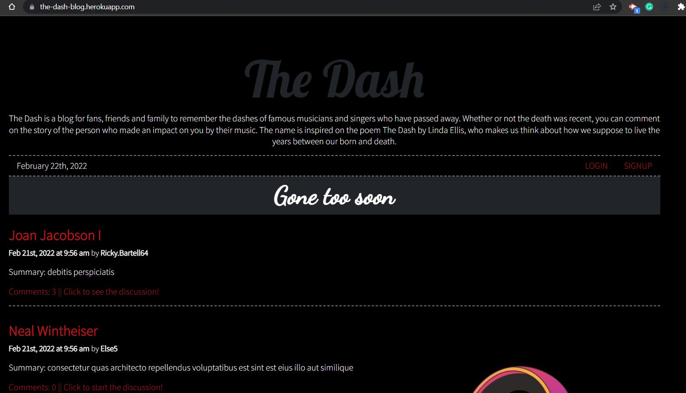

## The Dash

[](./LICENSE)

## Description

The Dash is a blog for fans, friends and family to remember the dashes of famous musicians and singers who have passed away. Whether or not the death was recent, you can comment on the story of the person who made an impact on you by their music.

## Project Requirements

Your group will use everything you’ve learned throughout this course to create a MERN stack single-page application that works with real-world data to solve a real-world challenge, with a focus on data and user demand. This project will provide you with the best opportunity to demonstrate your problem-solving skills, which employers will want to see during interviews. Once again, the user story and acceptance criteria will depend on the project that you create, but your project must fulfill the following requirements:

* Use React for the front end.

* Use GraphQL with a Node.js and Express.js server.

* Use MongoDB and the Mongoose ODM for the database.

* Use queries and mutations for retrieving, adding, updating, and deleting data.

* Be deployed using Heroku (with data).

* Have a polished UI.

* Be responsive.

* Be interactive (i.e., accept and respond to user input).

* Include authentication (JWT).

* Protect sensitive API key information on the server.

* Have a clean repository that meets quality coding standards (file structure, naming conventions, best practices for class and id naming conventions, indentation, high-quality comments, etc.).

* Have a high-quality README (with unique name, description, technologies used, screenshot, and link to deployed application).

### Screenshots


## Table of Contents

* [Description](#description)
* [Installation](#installation)
* [Usage](#usage)
* [Deployed](#deployed)
* [License](#license)
* [Questions](#questions)

## Installation

To install dependencies, run the following:

```
npm install
```

## Usage

After installing the dependencies, run the application with

```
npm run seed
```

```
npm run start
```

## Deployed

Live Deployed Application: [View Application](https://the-dash-blog.herokuapp.com/ "Live Deploy")

## Presentation

You can see the presentation [View presentation](https://drive.google.com/file/d/1iYqNA06wtTTppxeZxwYHcF4DD9NNq-aD/view?usp=sharing "presentation")

## License

[MIT license](./LICENSE).


## Questions

Questions about this repository? Please contact me at [gharduim@gmail.com](mailto:gharduim@gmail.com). View more of my work in GitHub at [Gustavo Harduim](https://github.com/gharduim) 